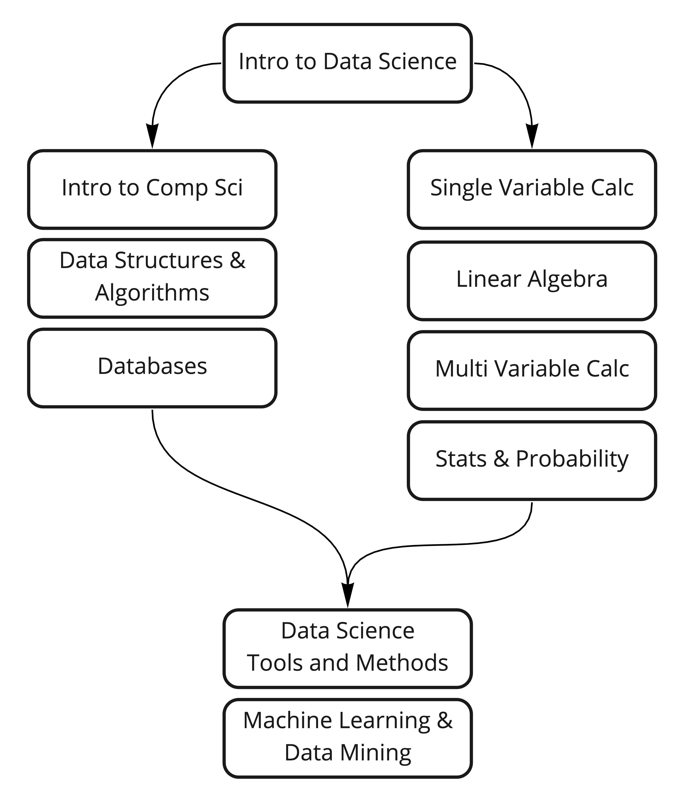

<h3>Open Source Society University</h3>

  :bar_chart: Path to a free self-taught education in <strong>Data Science</strong>!

  

## Contents

- [About](#about)
- [Curricular Guideline](#curricular-guideline)
- [Curriculum](#curriculum)
- [How to use this guide](#how-to-use-this-guide)
- [Prerequisites](#prerequisites)
- [How to contribute](#how-to-contribute)
- [Code of conduct](#code-of-conduct)
- [Community](#community)
- [Team](#team)

## About

This is a path for those of you who want to complete the Data Science undergraduate curriculum on your own time, **for free**, with courses from the **best universities** in the World.

In our curriculum, we give preference to MOOC (Massive Open Online Course) style courses because these courses were created with our style of learning in mind.

## Curricular Guideline

OSSU Data Science uses the report [Curriculum Guidelines for Undergraduate Programs in Data Science](https://www.amstat.org/asa/files/pdfs/EDU-DataScienceGuidelines.pdf) as our guide for course recommendation.

## Curriculum

### Introduction to Data Science
[What is Data Science](https://www.coursera.org/learn/what-is-datascience)

### Introduction to Computer Science
_Students who already know basic programming in any language can skip this first course_

[Introduction to programming](coursepages/intro-programming/README.md)

[Introduction to Computer Science and Programming Using Python](https://ocw.mit.edu/courses/6-0001-introduction-to-computer-science-and-programming-in-python-fall-2016/)

[Introduction to Computational Thinking and Data Science](https://ocw.mit.edu/courses/6-0002-introduction-to-computational-thinking-and-data-science-fall-2016/)

### Data Structures and Algorithms
_The Algorithms courses are taught in Java. If students need to learn Java, they should take this course first_

[Java Programming](https://java-programming.mooc.fi/)

[Algorithms, Part I](https://www.coursera.org/learn/algorithms-part1)

[Algorithms, Part II](https://www.coursera.org/learn/algorithms-part2)

### Databases
[Database Management Essentials](https://www.coursera.org/learn/database-management)

[Data Warehouse Concepts, Design, and Data Integration](https://www.coursera.org/learn/dwdesign)

[Relational Database Support for Data Warehouses](https://www.coursera.org/learn/dwrelational)

[Business Intelligence Concepts, Tools, and Applications](https://www.coursera.org/learn/business-intelligence-tools)

[Design and Build a Data Warehouse for Business Intelligence Implementation](https://www.coursera.org/learn/data-warehouse-bi-building)

[MongoDB for Developers Learning Path](https://university.mongodb.com/learning_paths/developer)

### Single Variable Calculus
[Calculus 1A: Differentiation](https://openlearninglibrary.mit.edu/courses/course-v1:MITx+18.01.1x+2T2019/about)

[Calculus 1B: Integration](https://openlearninglibrary.mit.edu/courses/course-v1:MITx+18.01.2x+3T2019/about)

[Calculus 1C: Coordinate Systems & Infinite Series](https://openlearninglibrary.mit.edu/courses/course-v1:MITx+18.01.3x+1T2020/about)

### Linear Algebra
[Essence of Linear Algebra](https://www.youtube.com/playlist?list=PLZHQObOWTQDPD3MizzM2xVFitgF8hE_ab)

[Linear Algebra](https://ocw.mit.edu/courses/mathematics/18-06sc-linear-algebra-fall-2011/)

### Multivariable Calculus
[Multivariable Calculus](http://ocw.mit.edu/courses/mathematics/18-02sc-multivariable-calculus-fall-2010/index.htm)

### Statistics & Probability
[Introduction to Probability](https://projects.iq.harvard.edu/stat110/home)

[Intro to Descriptive Statistics](https://www.udacity.com/course/intro-to-descriptive-statistics--ud827)

[Intro to Inferential Statistics](https://www.udacity.com/course/intro-to-inferential-statistics--ud201)

[Statistical Learning with Python by Stanford University on EdX](https://www.edx.org/learn/data-analysis-statistics/stanford-university-statistical-learning-with-python) or [Statistical Learning With R by Stanford University on EdX](https://www.edx.org/learn/statistics/stanford-university-statistical-learning)

### Data Science Tools & Methods
[Tools for Data Science](https://www.coursera.org/learn/open-source-tools-for-data-science)

[Data Science Methodology](https://www.coursera.org/learn/data-science-methodology)

[Data Science: Wrangling](https://www.edx.org/course/data-science-wrangling)

### Machine Learning/Data Mining
[Machine Learning](https://www.coursera.org/learn/machine-learning)

[Intro to Machine Learning](https://www.udacity.com/course/intro-to-machine-learning--ud120)

[Mining Massive Datasets](https://www.edx.org/course/mining-massive-datasets)

[Process Mining](https://www.coursera.org/learn/process-mining)

## How to use this guide

### Duration
It is possible to finish within about 2 years if you plan carefully and devote roughly 20 hours/week to your studies. Learners can use [this spreadsheet](https://docs.google.com/spreadsheets/d/1TEGSUQDFuWL3TYNjiM8G3esly-tKOcgHSDABt92mzdA/copy) to estimate their end date. Make a copy and input your start date and expected hours per week in the `Timeline` sheet. As you work through courses you can enter your actual course completion dates in the Curriculum Data sheet and get updated completion estimates.

### Order of the classes

Some courses can be taken in parallel, while others must be taken sequentially. All of the courses within a topic should be taken in the order listed in the curriculum. The graph below demonstrates how topics should be ordered.

### Track your progress

1. Create an account in [Trello](https://trello.com/).
1. Copy [this](https://trello.com/b/JpvLwQfr/ossu-data-science) board to your personal account.
See how to copy a board [here](https://help.trello.com/article/802-copying-cards-lists-or-boards).

Now you just need to pass the cards to the `Doing` column or `Done` column as you progress in your study.

### Which programming languages should I use?

Python and R are heavily used in Data Science community and our courses teach you both. Remember, the important thing for each course is to internalize the core concepts and to be able to use them with whatever tool (programming language) that you wish.

### Content Policy

You must share only files that you are allowed. **Do NOT disrespect the code of conduct** that you sign in the beginning of your courses.

## Prerequisites

The Data Science curriculum assumes the student has taken [high school math](https://github.com/ossu/computer-science/blob/master/FAQ.md#how-can-i-review-the-math-prerequisites) and [statistics](https://www.khanacademy.org/math/probability).

## How to contribute

You can [open an issue](https://help.github.com/articles/creating-an-issue/) and give us your suggestions as to how we can improve this guide, or what we can do to improve the learning experience.

You can also [fork this project](https://help.github.com/articles/fork-a-repo/) and send a [pull request](https://help.github.com/articles/using-pull-requests/) to fix any mistakes that you have found.

If you want to suggest a new resource, send a pull request adding such resource to the [extras](https://github.com/open-source-society/data-science/tree/master/extras) section. The **extras** section is a place where all of us will be able to submit interesting additional articles, books, courses and specializations.

## Code of Conduct
[OSSU's code of conduct](https://github.com/ossu/code-of-conduct).

## Community

We have a Discord server! This should be your first stop to talk with other OSSU students. [Why don't you introduce yourself right now?](https://discord.gg/wuytwK5s9h)

Subscribe to our [newsletter](https://tinyletter.com/OpenSourceSocietyUniversity).

You can also interact through [GitHub issues](https://github.com/open-source-society/data-science/issues).

Add **Open Source Society University** to your [Linkedin](https://www.linkedin.com/school/11272443/) and [Facebook](https://www.facebook.com/ossuniversity) profile!

## Team

* **Curriculum Maintainer**: [Waciuma Wanjohi](https://github.com/waciumawanjohi)
* **Contributors**: [contributors](https://github.com/open-source-society/data-science/graphs/contributors)
